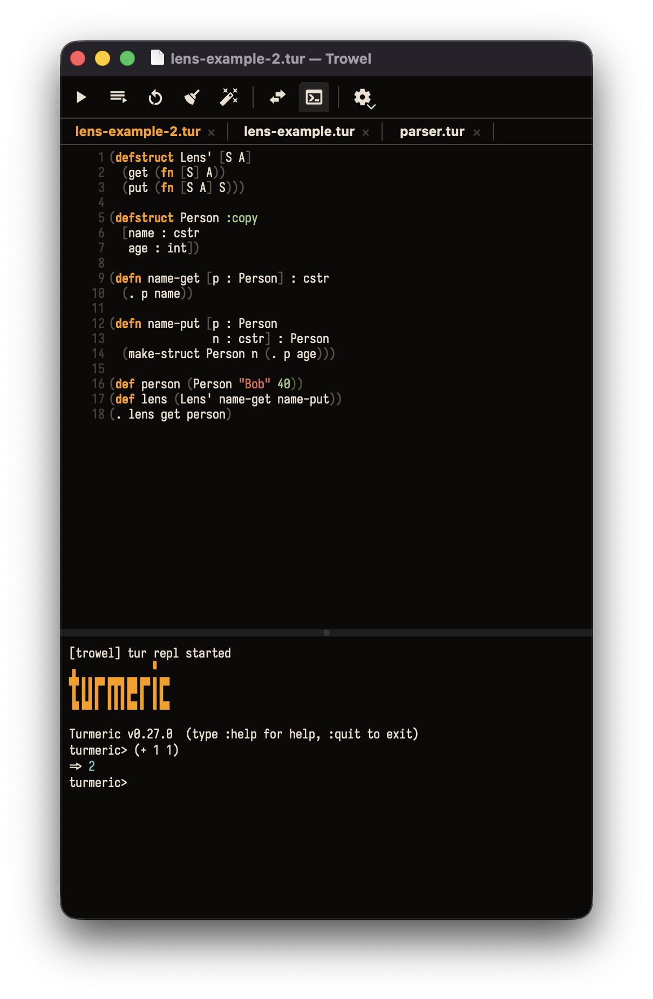

# Trowel

A native macOS editor for the [Turmeric](https://turmeric-lang.com)
programming language.



**Latest release:** `v0.0.3` — release-tooling patch: version now lives in a `VERSION` file and the Homebrew cask is updated automatically after publishing.

## Install

```
brew install --cask rjungemann/trowel/trowel
```

Or download the notarized `.zip` from
[the releases page](https://github.com/rjungemann/trowel/releases) and
drag `Trowel.app` into `/Applications`.

## Build from source

Requires macOS, Qt 6, CMake, and Ninja.

```
brew install cmake ninja qt@6
cmake -S . -B build -G Ninja \
    -DCMAKE_BUILD_TYPE=Release \
    -DCMAKE_PREFIX_PATH="$(brew --prefix qt@6)"
cmake --build build
open build/trowel.app
```

For Developer ID signing and notarization, see
[`docs/guides/signing-and-notarization.md`](docs/guides/signing-and-notarization.md).

## Releasing

Use one of the Claude Code slash commands:

- `/cut-patch-release` — bug fixes only (`x.y.Z`)
- `/cut-minor-release` — new features, backward-compatible (`x.Y.0`)
- `/cut-major-release` — breaking changes (`X.0.0`)

Each command bumps the version in `CMakeLists.txt`, updates `CHANGELOG.md`
and this README's "Latest release" line, commits, tags, and pushes. The
tag push fires `.github/workflows/release.yml`, which builds, signs,
notarizes, and publishes the GitHub Release.

## License

TBD.
